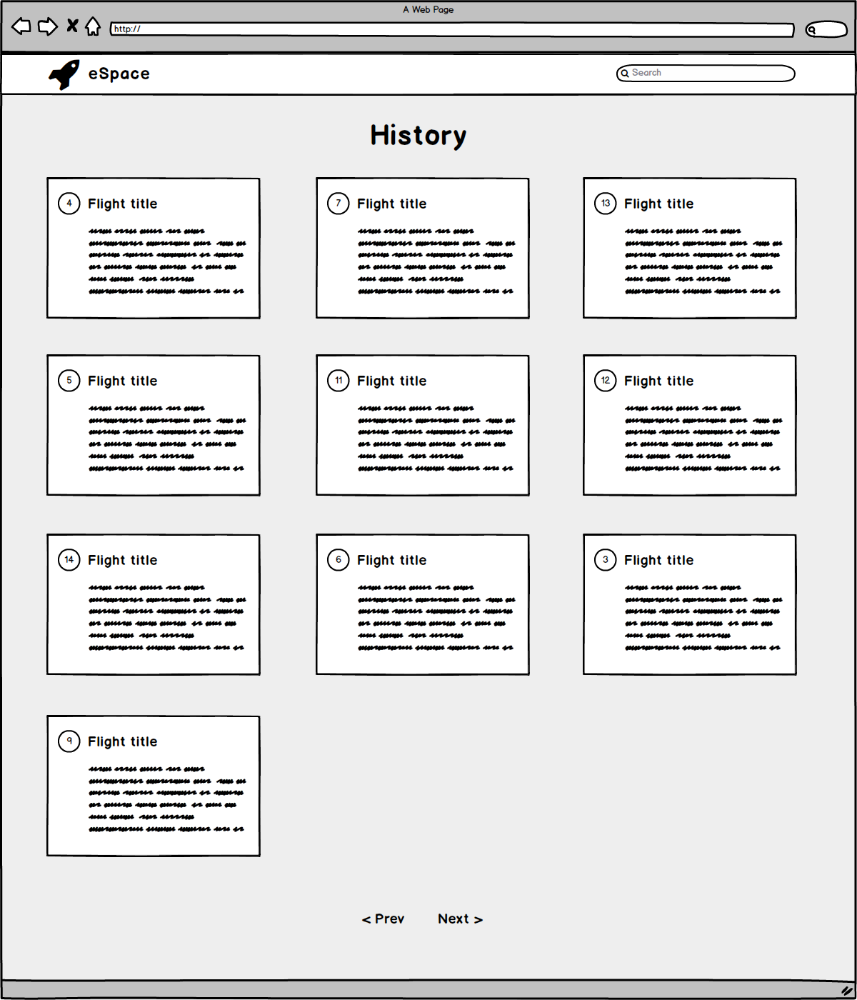
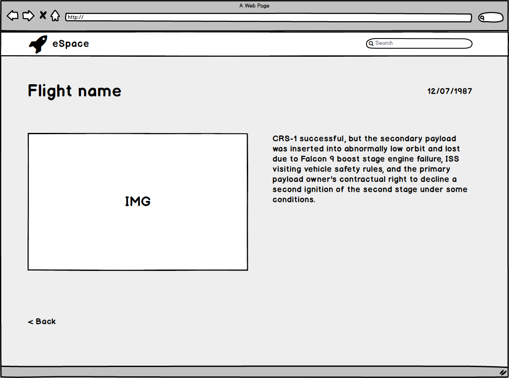

# It's time for space exploration :rocket:

## In order to make new steps in Space first we need to look at history

### #1 You will have to find out and list all Space flights from this endpoint:

`https://api.spacexdata.com/v3/history?limit=10`

Params: 
 - `limit`, integer, example:10
 - `offset`, integer, example: 0

Requirements:
 - List flights
 - Don't show records that don't have `flight_number`
 - Show `flight_number`, `title`, `detailes` on card
 - Click on `title` will open new screen with Launch detailes about that flight

Bonus:
 - Make search field that will filter displayed card based by Flight title
 - Make Layout with Cards Responsive

### #2 Screen with Launch info about flight

`https://api.spacexdata.com/v3/launches?flight_number=<id>`

Requirements:
 - Show was the mission successful or not
 - Present mission name, mission id and detailes that you can find 
 - Display mission patch small image
 - Back to history page button

Bonus:
 - If there is YouTube video present, click on image will play that youtube

